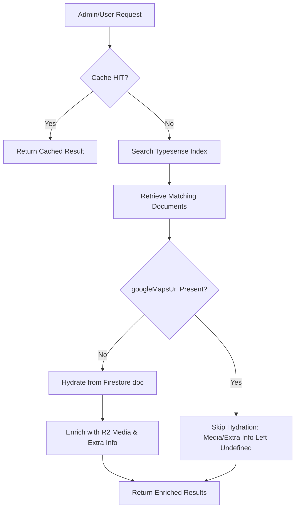

# Data Storage & Organization Audit Report: Tourist Places

## Executive Summary
This audit investigates why some tourist place photos stored in Cloudflare R2 are not displaying in the client and admin interfaces, and why rich text descriptions are missing or blank for certain records. 

Our investigation revealed two critical system defects:
1. **Faulty Hydration Logic**: A bug in the hydration logic (`enrichPlacesWithMapUrls`) in the client and admin list API routes causes records with a Google Maps URL to completely skip loading the Firestore document. Since Typesense does not index nested arrays like `media` (R2 photos/videos) or `extraInfo`, these records display as having no photos and no extra info.
2. **Data Deletion on Sync**: When an admin updates a tourist place, the sync payload passed to Typesense completely omits the `description` and `googleMapsUrl` fields. As a result, the description and map URL are deleted (set to empty strings) in the search index.
3. **Missing Indexing on Creation**: When a new tourist place is created, the system fails to call `SyncService.syncOnCreate()`, leaving the place entirely unindexed in Typesense until a manual sync occurs.

---

## 🏗️ System Architecture & Data Flow

Tourist Place data is distributed across three main layers:
1. **Source of Truth (Firestore)**: Stores the complete document, including raw HTML descriptions, the `media` array (R2 URLs, thumbnails, and captions), and `extraInfo`.
2. **Search Index (Typesense)**: Stores search-optimized flat fields (`name`, `city`, `state`, `country`, `category`, `popularity`, `coverImage`, `description`, `googleMapsUrl`) to provide sub-50ms full-text searches. It **does not** index nested arrays like `media` or `extraInfo` to keep the index light.
3. **Cache Layers (L1/Memory & L2/Redis)**: Cache the formatted API responses to avoid hit limits on Firestore/Typesense.



---

## 🔍 Root Cause Analysis

### 1. Hydration Skip Bug (R2 Photos & Extra Info Missing)
* **Affected Files**:
  * [client/src/app/api/places/route.ts](file:///d:/Projects/Abjee%20Test/abjee-next-test/client/src/app/api/places/route.ts)
  * [client/src/app/api/admin/tourist-places/list/route.ts](file:///d:/Projects/Abjee%20Test/abjee-next-test/client/src/app/api/admin/tourist-places/list/route.ts)
* **Underlying Logic**:
  The function `enrichPlacesWithMapUrls` is responsible for fetching full data from Firestore to populate nested fields like `media` and `extraInfo`. However, it filters document IDs to fetch based on whether the `googleMapsUrl` is missing:
  ```typescript
  const missingMapIds = rows
    .filter((row) => row?.id && !String(row.googleMapsUrl || '').trim())
    .map((row) => String(row.id));
  ```
  * **The Bug**: If a place **has** a Google Maps link in Typesense, it will *not* be added to `missingMapIds`. Consequently, it is *not* fetched from Firestore, meaning its `media` (containing all the R2 image/video URLs) and `extraInfo` fields remain `undefined`.
  * **Result**:
    * **Client side** ([TourPlaces.tsx](file:///d:/Projects/Abjee%20Test/abjee-next-test/client/src/screens/TourPlaces.tsx)): Clicking on a place with a maps link opens a detail modal with 0 photos, 0 videos, and no extra info blocks.
    * **Admin side** ([tourist-places.tsx](file:///d:/Projects/Abjee%20Test/abjee-next-test/client/src/components/ui/tourist-places.tsx)): The grid card view fails to render thumbnails or media counts for these places.

### 2. Omitted Fields in Typesense Update (Rich Text & Maps URL Erased)
* **Affected Files**:
  * [client/src/app/api/admin/tourist-places/route.ts](file:///d:/Projects/Abjee%20Test/abjee-next-test/client/src/app/api/admin/tourist-places/route.ts) (PUT handler)
  * [client/src/app/api/admin/tourist-places/[id]/route.ts](file:///d:/Projects/Abjee%20Test/abjee-next-test/client/src/app/api/admin/tourist-places/%5Bid%5D/route.ts) (PUT handler)
* **Underlying Logic**:
  When an administrator saves updates to a tourist place, the PUT handlers save the full document in Firestore and then invoke `SyncService.syncOnUpdate` to sync the changes to Typesense:
  ```typescript
  await SyncService.syncOnUpdate({
    id,
    name: updateData.name,
    city: updateData.city,
    state: updateData.state,
    country: updateData.country,
    popularity: updateData.popularity,
    updatedAt: updateData.updatedAt,
    category: updateData.category,
    coverImage: updateData.coverImage
    // OMITTED: description and googleMapsUrl
  });
  ```
  * **The Bug**: Since `description` and `googleMapsUrl` are omitted from this payload, `SyncService` receives them as `undefined`. During transformation, it converts them to empty strings (`""`) and updates Typesense.
  * **Result**:
    1. **Typesense Search Failures**: Full-text searching on the description of updated places fails because the description is now empty in the index.
    2. **Maps Link Disappears from Index**: The `googleMapsUrl` becomes empty in Typesense, which triggers a secondary side-effect (Issue 1's logic now hydates the place because `googleMapsUrl` is empty, hiding the media issue temporarily but breaking the map links unless updated).

### 3. Missing Indexing on Document Creation
* **Affected File**: [client/src/app/api/admin/tourist-places/create/route.ts](file:///d:/Projects/Abjee%20Test/abjee-next-test/client/src/app/api/admin/tourist-places/create/route.ts)
* **The Bug**: The POST handler writes the new document to Firestore and calls `updateSharedPlaceInCache` for Redis, but completely misses calling `SyncService.syncOnCreate()`.
* **Result**: Newly created tourist places do not appear in any search results until a developer triggers a manual recovery/sync job.

---

## 🛠️ Remediation Plan

To fix these issues permanently, we recommend making the following targeted corrections:

### Fix 1: Hydrate All Search Results from Firestore
Modify `enrichPlacesWithMapUrls` in both route handlers to fetch Firestore documents for **all** returned search results. Since search is paginated to small batches (12 on the client, 30 on the admin), fetching them in a single batch read via `adminDb.getAll()` is fast and avoids hitting read limits.

```diff
-async function enrichPlacesWithMapUrls(rows: any[]) {
-  const missingMapIds = rows
-    .filter((row) => row?.id && !String(row.googleMapsUrl || '').trim())
-    .map((row) => String(row.id));
-
-  if (missingMapIds.length === 0) return rows;
-
-  const refs = missingMapIds.map((id) => adminDb.collection('touristPlaces').doc(id));
-  const docs = await adminDb.getAll(...refs).catch(() => []);
-  const byId = new Map(docs.filter((snap) => snap.exists).map((snap) => [snap.id, snap.data() || {}]));
-
-  return rows.map((row) => {
-    const full = byId.get(String(row?.id || ''));
-    if (!full) return row;
-
-    return {
-      ...row,
-      googleMapsUrl: row.googleMapsUrl || full.googleMapsUrl || '',
-      extraInfo: row.extraInfo || full.extraInfo || [],
-      media: row.media || full.media || [],
-    };
-  });
-}
+async function enrichPlacesFromFirestore(rows: any[]) {
+  const ids = rows.filter((row) => row?.id).map((row) => String(row.id));
+  if (ids.length === 0) return rows;
+
+  const refs = ids.map((id) => adminDb.collection('touristPlaces').doc(id));
+  const docs = await adminDb.getAll(...refs).catch(() => []);
+  const byId = new Map(docs.filter((snap) => snap.exists).map((snap) => [snap.id, snap.data() || {}]));
+
+  return rows.map((row) => {
+    const full = byId.get(String(row?.id || ''));
+    if (!full) return row;
+
+    return {
+      ...row,
+      googleMapsUrl: row.googleMapsUrl || full.googleMapsUrl || '',
+      extraInfo: full.extraInfo || [],
+      media: full.media || [],
+      description: full.description || row.description || '',
+    };
+  });
+}
```

### Fix 2: Provide Description & Maps URL in Admin Update Payloads
Update the sync payloads in the PUT route handlers to include the updated description and Google Maps URL.

**In `client/src/app/api/admin/tourist-places/route.ts` & `[id]/route.ts`**:
```diff
    await SyncService.syncOnUpdate({
      id, // or placeId
      name: updateData.name,
      city: updateData.city,
      state: updateData.state,
      country: updateData.country,
      popularity: updateData.popularity,
      updatedAt: updateData.updatedAt,
      category: updateData.category,
      coverImage: updateData.coverImage,
+     description: updateData.description,
+     googleMapsUrl: updateData.googleMapsUrl
    });
```

### Fix 3: Index Newly Created Places
Call `SyncService.syncOnCreate` in the POST route handler.

**In `client/src/app/api/admin/tourist-places/create/route.ts`**:
```diff
    const docRef = await adminDb.collection('touristPlaces').add({
      ...touristPlace,
      ...searchFields,
    });
    
+   // Sync to Typesense search index
+   await SyncService.syncOnCreate({
+     id: docRef.id,
+     name: touristPlace.name,
+     city: touristPlace.city,
+     state: touristPlace.state,
+     country: touristPlace.country,
+     popularity: 0,
+     updatedAt: touristPlace.updatedAt,
+     category: touristPlace.category,
+     coverImage: touristPlace.coverImage,
+     description: touristPlace.description,
+     googleMapsUrl: touristPlace.googleMapsUrl
+   }).catch((err) => console.warn('[Admin:Create] Typesense sync failed:', err));
```

---

## 📈 Verification Steps

After implementing the fixes:
1. **R2 Media Verification**: 
   * Navigate to the client dashboard search page.
   * Search for a place with a maps link (e.g. Belur Math or Mysore Palace).
   * Confirm that R2 gallery photos load in the detail modal and thumbnails render in the admin grid cards.
2. **Rich Text Verification**:
   * Update a place's description with bold and bulleted points in the Admin.
   * Search for a keyword within that updated description in the client.
   * Verify that the results appear and render with correct HTML formatting (no missing sections, no plain text fallback).
3. **Creation Index Verification**:
   * Create a new test tourist place.
   * Immediately search for it in the client. It should display in the search results list.
